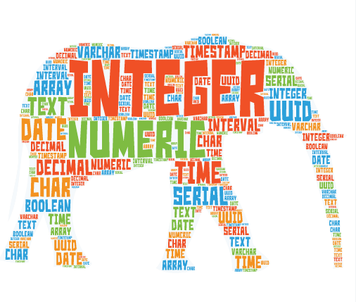

# Overview of PostgreSql Data Types

In the module [00_psql_setup](../00_psq_setup/01_intro.md) we'll introduce the PostgrSql DBMS. However, we think is important to introduce an overview of the data types supported by **PostgreSql**.

PostgreSQL supports the following data types:

- [Boolean](https://www.postgresqltutorial.com/postgresql-tutorial/postgresql-boolean/)
- Character types such as [char, varchar, and text](https://www.postgresqltutorial.com/postgresql-tutorial/postgresql-char-varchar-text/).
- [Numeric](https://www.postgresqltutorial.com/postgresql-tutorial/postgresql-integer/) type, [integer](https://www.postgresqltutorial.com/postgresql-tutorial/postgresql-integer/) and [floating-point](https://www.postgresqltutorial.com/postgresql-tutorial/postgresql-data-types/) number.
- Temporal types such as [date](https://www.postgresqltutorial.com/postgresql-tutorial/postgresql-date/), [time](https://www.postgresqltutorial.com/postgresql-tutorial/postgresql-time/), [timestamp](https://www.postgresqltutorial.com/postgresql-tutorial/postgresql-timestamp/), and [interval](https://www.postgresqltutorial.com/postgresql-tutorial/postgresql-interval/)
- [UUID](https://www.postgresqltutorial.com/postgresql-tutorial/postgresql-serial/) for storing Universally Unique Identifiers, like autoincrement keys.
- [Array](https://www.postgresqltutorial.com/postgresql-tutorial/postgresql-array/) for storing array strings, numbers, etc.
- [JSON](https://www.postgresqltutorial.com/postgresql-tutorial/postgresql-json/) stores JSON data
- hstore stores key-value pair
- Special types such as network address and geometric data.

A general list is given [here](https://www.postgresqltutorial.com/postgresql-tutorial/postgresql-data-types/)
