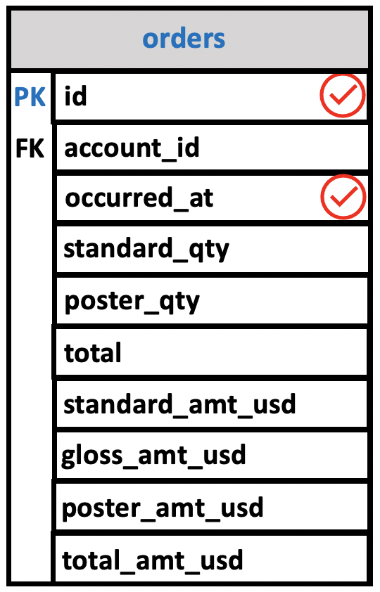
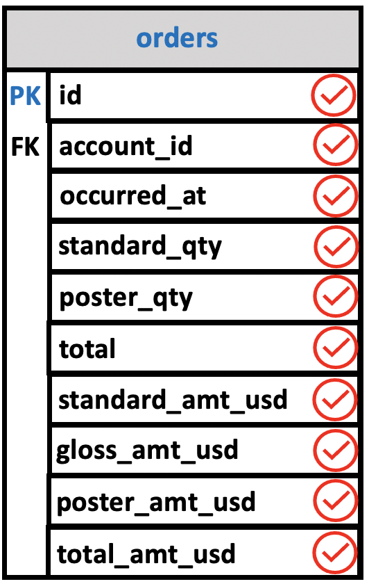

# SELECT & FROM

By far the most used SQL's verbs is **SELECT**. Since the most common operation performed on a database is to examine its data, it should not be surprising that the SQL statement that performs this task is the workhorse of the language. In any real database, of course, other SQL statements should have to be used first to create the database's tables and fill them with records. For most SQL users, however, this task will already have been performed, and so we begin with SELECT.

## Selecting Specific Columns in a Table

To see the values of certain columns for all of a table's records, you must give both the names of those columns and the name of the table. The general form is

```console
SELECT <column names>
  FROM <table>;
```

where `<column names>` is replaced by the names of the desired columns, separated by commas, and `<table>` is replaced by the name of a table that contains those columns.

**Note**: **Throughout this notes, words flanked by < and > represent placeholders for a type of thing and replaced by specific instances of those things in actual SQL queries.**

In general, if you specify a column that is not defined for that table, you will get some kind of error message depending on exactly what system you are using. Otherwise, the results of your query, a list of the desired values, will appear.

**To show these result visually**, the query diagram contains a representation of the table being queried with a **check mark next to each column selected by the query**.

## Example Parch & Posey

First, we are going to generate a list of all of the **orders** that Parch and Posey has ever received.

Parch and Posey records their orders in a table called **orders**. That table contains all the columns you see here.

```console
parch_posey=> \d orders
                              Table "public.orders"
      Column      |            Type             | Collation | Nullable | Default
------------------+-----------------------------+-----------+----------+---------
 id               | integer                     |           | not null |
 account_id       | integer                     |           |          |
 occurred_at      | timestamp without time zone |           |          |
 standard_qty     | integer                     |           |          |
 gloss_qty        | integer                     |           |          |
 poster_qty       | integer                     |           |          |
 total            | integer                     |           |          |
 standard_amt_usd | numeric(10,2)               |           |          |
 gloss_amt_usd    | numeric(10,2)               |           |          |
 poster_amt_usd   | numeric(10,2)               |           |          |
 total_amt_usd    | numeric(10,2)               |           |          |
Indexes:
    "orders_pkey" PRIMARY KEY, btree (id)
```

- `id`: Each order has an UNIQUE id or PRIMARY KEY, so it can be referenced
- `occurred_at`: a timestamp to indicate when that order was placed.

It also contains quantity sold for each type of paper sold and the total:

- `standard_qty`
- `gloss_qty`
- `poster_qty`
- `total`

It also contains the revenue:

- `standard_amt_usd`
- `gloss_amt_usd`
- `poster_amt_usd`
- `total_amt_usd`

In order to generate the list of all orders, we'll write a SELECT statement.

Think of a SELECT statement as filling out a form to get a set of results you are trying to get.

The form has a set of questions, like:

1. What data you want to pull from?
2. Which elements of that data set from the data base do you want to pull?

These questions are structured in the same order every time. Some of them are **mandatory** and other are optional.

When writing out the SELECT statement, each of these questions is represented by a single word like **SELECT** or **FROM**. These words are called **CLAUSES**.

```console
SELECT
  FROM
```

### FROM

The **FROM** clause: Tells the query **What data to use**.

```console
SELECT
  FROM orders
```

Here, we're looking at the **orders** table.

### SELECT

The **SELECT** clause tells the query **which columns to read from the table**.

```console
SELECT id, occurred_at
  FROM orders;
```



Let’s examine the SELECT statement in more detail:

- First, specify a select list that can be a column or a list of columns in a table from which you want to retrieve data. If you specify a list of columns, you need to place a comma (,) between two columns to separate them. If you want to select data from all the columns of the table, you can use an asterisk (`*`) shorthand instead of specifying all the column names. The select list may also contain expressions or literal values.
- Second, specify the name of the table from which you want to query data after the FROM keyword.

```console
SELECT id,
       occurred_at
  FROM orders
 LIMIT 3;
```

Let's run the command in the `psql` prompt and limit the output results to the first three rows:

```console
parch_posey=> SELECT id,
parch_posey->        occurred_at
parch_posey->   FROM orders
parch_posey->  LIMIT 3;
 id |     occurred_at
----+---------------------
  1 | 2015-10-06 17:31:14
  2 | 2015-11-05 03:34:33
  3 | 2015-12-04 04:21:55
(3 rows)
```


### Selecting all columns in a table

It is often useful to see the value of every field for every record in a table. One way to do this is by listing the names of every column in that table, similar to the example we have just seen. Because this is just a frequent operation, however, SQL provides a shorthand way to list all values in a table.

Instead of actually listing all column names, you can type an asterisk `*` instead. The general form is:

```console
SELECT *
  FROM <table>;
```

where `<table>` is replaced by the name of a table. Unsurprisingly, the query diagram for this shows the table with a check by every column name.

#### Example

```console
SELECT *
  FROM orders;
```




PostgreSQL evaluates the FROM clause before the SELECT clause in the SELECT statement.

> Note that the SQL keywords are case-insensitive. It means that SELECT is equivalent to select or Select. By convention, **we will use all the SQL keywords in uppercase to make the queries easier to read**.

Notice that we added a semicolon (`;`) **at the end of the** `SELECT` statement. The **semicolon is not a part of the SQL statement**.

- **It is used to signal PostgreSQL the end of an SQL statement**.
- **The semicolon is also used to separate two SQL statements**.

**Both the SELECT and FROM clauses are mandatory**.

## Export PostgreSQL query to a csv

```console
(base) ludo /~  $  psql parch_posey
psql (11.4)
Type "help" for help.

parch_posey=# COPY (SELECT * FROM orders LIMIT 3) TO '/Users/ludovicopinzari/orders_query.csv' DELIMITER ',' CSV HEADER;
COPY 3
parch_posey=# \q
```

You must login as a superuser to export the query on your local machine. the command is:

- `COPY (SELECT * FROM orders LIMIT 3) TO '/Users/ludovicopinzari/orders_query.csv' DELIMITER ',' CSV HEADER;`

We saved the file in the current directory.

```console
(base) ludo /~  $  cat orders_query.csv
id,account_id,occurred_at,standard_qty,gloss_qty,poster_qty,total,standard_amt_usd,gloss_amt_usd,poster_amt_usd,total_amt_usd
1,1001,2015-10-06 17:31:14,123,22,24,169,613.77,164.78,194.88,973.43
2,1001,2015-11-05 03:34:33,190,41,57,288,948.10,307.09,462.84,1718.03
3,1001,2015-12-04 04:21:55,85,47,0,132,424.15,352.03,0.00,776.18
```

We can also open the file with Excel or a text editor.

## Summary

Here you were introduced to the SQL command that will be used in every query you write: `SELECT` ... `FROM` ....

- **SELECT** indicates which column(s) you want to be given the data for.

- **FROM** specifies from which table(s) you want to select the columns. Notice the columns need to exist in this table.

If you want to be provided with the data from all columns in the table, you use "`*`", like so:

- `SELECT * FROM orders`

Note that using SELECT does not create a new table with these columns in the database, it just provides the data to you as the results, or output, of this command.

You will use this SQL SELECT statement in every query in this course, but you will be learning a few additional statements and operators that can be used along with them to ask more advanced questions of your data.

## Further resources

- [SELECT](https://www.postgresqltutorial.com/postgresql-tutorial/postgresql-select/) on  tutorial page.
