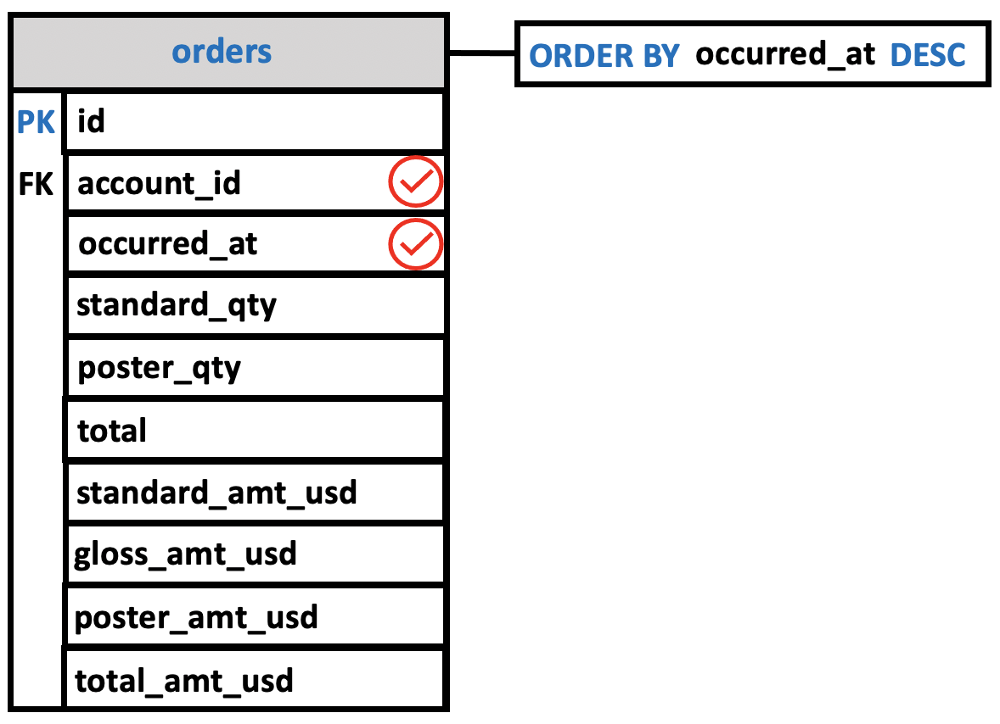
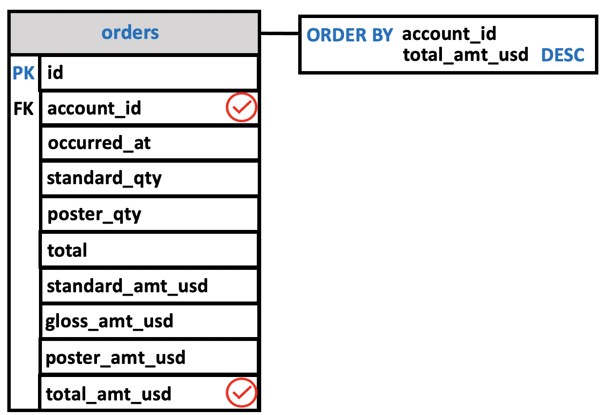
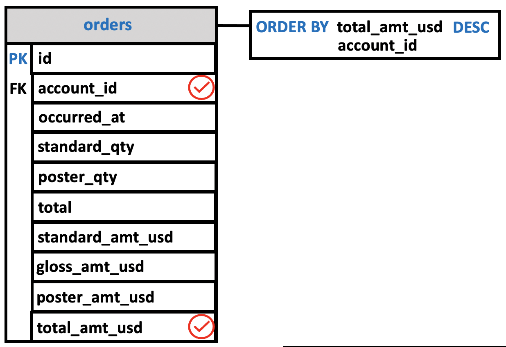

# ORDER BY clause

The order of the records within a table has no significance to SQL.  **When records are retrieved from a table**, therefore, **the order in which they appear is arbitrary**. So, When you query data from a table, **the** `SELECT` **statement returns rows in an unspecified order**.

Yet sometimes we wish to see the data resulting from a query ordered in a specific way. To allow this, SQL provides the `ORDER BY` clause for the `SELECT` statement.

**To sort the rows of the result set**, you use the `ORDER BY` clause in the SELECT statement.

The general form of a `SELECT` **statement using** `ORDER BY` is:

```console
SELECT <column names>
  FROM <table>
 ORDER BY <column names>;
```

As before, `<column names>` after `SELECT` and `<table>` indicate the columns that should be selected from the named table. Most importantly for our purposes, the `<column names>` following `ORDER BY` indicate the column(s) whose values should be used to order the selected records. The default order is **ascending order** or `ASC`.

SQL also allows records to be listed in **reverse order** or **descending order**.

```console
SELECT <column names>
  FROM <table>
 ORDER BY <column names> DESC;
```

The following illustrates the syntax of the ORDER BY clause:

```cosnole
SELECT <column names>
  FROM <table>
 ORDER BY <column name> (ASC | DESC),
          <column name> (ASC | DESC),
            ...            ...
          <column name> (ASC | DESC);
```
this syntax:

First, specify a column that you want to sort after the ORDER BY keywords. If you want to sort the result set based on multiple columns you need to place a comma (,) between two columns or expressions to separate them.
Second, you use the `ASC` option to sort rows in ascending order and the `DESC` option to sort rows in descending order. If you omit the `ASC` or `DESC` option, the `ORDER BY` **uses** `ASC` **by default**.

PostgreSQL evaluates the clauses in the SELECT statment in the following order: FROM, SELECT, and ORDER BY:

```console
FROM -> SELECT -> ORDER BY
```

Due to the order of evaluation, if you have a column `alias` in the SELECT clause, you can use it in the ORDER BY clause. But we'll talk about alias in the following lessons.

Let’s take some examples of using the PostgreSQL ORDER BY clause.

The **query diagram** for `ORDER BY` is shows the selected table with a **box indicating the column on which the ordering is based**. If two or more columns are used, both are included in the `ORDER BY` box.

## Ordering Data example

Imagine yourself in the finance department at Parch & Posey. You want to look up the **most recent** orders, so that you can confirm that invoices have been sent to those customers.

The `ORDER BY` clause will help you to accomplish this by **allowing you to sort the orders by date**.

Let's first take a look at how data is ordered by default.

```console
parch_posey=# SELECT id,
parch_posey-#        account_id,
parch_posey-#        occurred_at
parch_posey-#   FROM orders
parch_posey-#   LIMIT 20;

id | account_id |     occurred_at
----+------------+---------------------
  1 |       1001 | 2015-10-06 17:31:14
  2 |       1001 | 2015-11-05 03:34:33
  3 |       1001 | 2015-12-04 04:21:55
  4 |       1001 | 2016-01-02 01:18:24
  5 |       1001 | 2016-02-01 19:27:27
  6 |       1001 | 2016-03-02 15:29:32
  7 |       1001 | 2016-04-01 11:20:18
  8 |       1001 | 2016-05-01 15:55:51
  9 |       1001 | 2016-05-31 21:22:48
 10 |       1001 | 2016-06-30 12:32:05
 11 |       1001 | 2016-07-30 03:26:30
 12 |       1001 | 2016-08-28 07:13:39
 13 |       1001 | 2016-09-26 23:28:25
 14 |       1001 | 2016-10-26 20:31:30
 15 |       1001 | 2016-11-25 23:21:32
 16 |       1001 | 2016-12-24 05:53:13
 17 |       1011 | 2016-12-21 10:59:34
 18 |       1021 | 2015-10-12 02:21:56
 19 |       1021 | 2015-11-11 07:37:01
 20 |       1021 | 2015-12-11 16:53:18
(20 rows)
```

You'll notice that this table `appears` to be sorted by `account_id`. It starts at 1001 and goes to 1011, 1021 ... However, the order of the rows in the table has no significance to SQL.

### Using PostgreSQL ORDER BY clause to sort rows by one column

Let's add an `ORDER BY` clause to **reorder** the results **based on the date the order was placed**, which you can see in the `occurred_at` column.

```console
SELECT account_id,
       occurred_at
  FROM orders
 ORDER BY occurred_at
 LIMIT 20;
```

Notice that the `ORSER BY` clause goes between the `FROM` and `LIMIT` clauses. Remember the `ORDER BY` **must appear after** `FROM` **and before** `LIMIT` **clauses**. **You must write the clauses in this order, or the query will not run**.


```console
parch_posey=# SELECT account_id,
parch_posey-#        occurred_at
parch_posey-#   FROM orders
parch_posey-#  ORDER BY occurred_at
parch_posey-#  LIMIT 20;
 account_id |     occurred_at
------------+---------------------
       2861 | 2013-12-04 04:22:44
       2861 | 2013-12-04 04:45:54
       4311 | 2013-12-04 04:53:25
       1281 | 2013-12-05 20:29:16
       1281 | 2013-12-05 20:33:56
       2481 | 2013-12-06 02:13:20
       3431 | 2013-12-06 12:55:22
       3431 | 2013-12-06 12:57:41
       3251 | 2013-12-06 13:14:47
       3251 | 2013-12-06 13:17:25
       3491 | 2013-12-06 23:45:16
       3491 | 2013-12-06 23:47:45
       2731 | 2013-12-08 00:54:42
       4491 | 2013-12-08 06:34:23
       1301 | 2013-12-08 07:05:07
       1301 | 2013-12-08 07:11:38
       1881 | 2013-12-08 18:24:52
       1881 | 2013-12-08 18:32:52
       3141 | 2013-12-08 20:13:49
       3141 | 2013-12-08 20:37:53
(20 rows)
```

By the **default**, `ORDER BY` goes from:

- `a` to `z`, **Ascending alphabetical order**.
- `lowest` to `highest`, **Ascending numerical order**.
- `earliest` to `latest`, **Ascending date order**.

This is referred to as **ascending** order. You'll notice that that's happening in the result of our last query. The **earliest date** is `2013-12-04 04:22:44` and the client `2861` is the first client that placed an order.

## Using PostgreSQL ORDER BY clause to sort rows by one column in descending order

If you want to order the other way, you can add `DESC` option, short for **descending**, to the **end of the** `ORDER BY` clause. This will get us the data set that we're after, which **shows the 10 most recent orders** with the most recent at the top.

```console
SELECT account_id,
       occurred_at
  FROM orders
  ORDER BY occurred_at DESC
  LIMIT 10;
```



```console
parch_posey=# SELECT account_id,
parch_posey-#        occurred_at
parch_posey-#   FROM orders
parch_posey-#  ORDER BY occurred_at DESC
parch_posey-#  LIMIT 10;
 account_id |     occurred_at
------------+---------------------
       3841 | 2017-01-02 00:02:40
       3841 | 2017-01-01 23:50:16
       3861 | 2017-01-01 22:29:50
       3861 | 2017-01-01 22:17:26
       4051 | 2017-01-01 21:04:25
       4051 | 2017-01-01 20:52:23
       1761 | 2017-01-01 17:34:10
       1961 | 2017-01-01 16:40:57
       3431 | 2017-01-01 14:05:39
       3431 | 2017-01-01 13:57:21
(10 rows)
```
The last order was placed the `2017-01-02 00:02:40`.

### Using PostgreSQL ORDER BY clause to sort rows by multiple columns

Let's say you want to **order results by** `account`, and **within each account**, have **orders sorted** from **largest to smallest**, so you'll be able to quickly see

- what the largest orders were for each account.

You can use an `ORDER BY` clause **over multiple columns** to achieve this, and the **sorting** will happen in **the order that you specify the columns**.

```console
SELECT account_id
       total_amt_usd
  FROM orders
 ORDER BY account_id,
          total_amt_usd DESC
```


so, let's start by ordering by `account_id` first, and then `total_amt_usd`, which we'll make **descending**, so the largest values will be first.

```console
parch_posey=# SELECT account_id,
parch_posey-#        total_amt_usd
parch_posey-#   FROM orders
parch_posey-#  ORDER BY account_id,
parch_posey-#           total_amt_usd DESC;
account_id | total_amt_usd
------------+---------------
      1001 |       9426.71
      1001 |       9230.67
      1001 |       9134.31
      1001 |       8963.91
      1001 |       8863.24
      1001 |       8757.18
      .... |        ......
      .... |        ......
      .... |        ......
      1011 |       2734.59
      1021 |       2945.73
      1021 |       2944.24
      1021 |       2936.92
      1021 |       2747.11
      .... |       .......
```

So, I run this, you can see that the first account we get is `1001` and then the orders descends from `9426` all the way down to `2734.59`. And then after that, we have `1021` and that account's largest orders and so forth.

Now, what happens if I flip the columns in the `ORDER BY` clause.

```console
SELECT account_id
       total_amt_usd
  FROM orders
 ORDER BY total_amt_usd DESC,
          account_id;
```

So, the amount will be first and then we sort by account_id.



```console
parch_posey=# SELECT account_id,
parch_posey-#        total_amt_usd
parch_posey-#   FROM orders
parch_posey-#  ORDER BY total_amt_usd DESC,
parch_posey-#           account_id
parch_posey-#  LIMIT 50;
 account_id | total_amt_usd
------------+---------------
       4251 |     232207.07
       4161 |     112875.18
       4211 |     107533.55
       2861 |      95005.82
       4101 |      93547.84
       4111 |      93505.69
       1301 |      93106.81
       1521 |      92991.05
       1341 |      84099.62
       4151 |      82163.71
       .... |      ........
```

What's happening here is that we're starting with the highest amount and sorting descending. So, this is the largest order of all time at `$ 232207.07` and that went to account `4251`. Now, it doesn't seem to be sorting by `account_id`. The reason for that is that, all of these amounts **are so precise** that there aren't multiple rows of the same amount. So, if there were two rows in the set with the exact same amount, you might notice that account_id within that is sorted from smallest to largest. So the secondary sorting by account ID **is difficult to see here**, since only if there were two orders with equal total dollar amounts would there need to be any sorting by account ID.

## Summary

The `ORDER BY` statement **allows us to sort our results using the data in any column**. If you are familiar with *Excel* or *Google Sheets*, using `ORDER BY` is similar to sorting a sheet using a column. A key difference, however, is that **using ORDER BY in a SQL query only has temporary effects**, for the results of that query, unlike sorting a sheet by column in Excel or Sheets.

In other words, when you use ORDER BY in a SQL query, your output will be sorted that way, but then the next query you run will encounter the unsorted data again. It's important to keep in mind that this is different than using common spreadsheet software, where sorting the spreadsheet by column actually alters the data in that sheet until you undo or change that sorting. This highlights the meaning and function of a SQL "query."

The **ORDER BY** statement always comes in a query after the **SELECT** and **FROM** statements, but before the **LIMIT** statement.

If you are using the **LIMIT** statement, it **will always appear last**. As you learn additional commands, the order of these statements will matter more.

Remember `DESC` can be added after the column in your `ORDER BY` statement to sort in descending order, as the default is to sort in ascending order.

Lastly, we saw that we can `ORDER BY` **more than one column at a time**. When you **provide a list of columns** in an ORDER BY command, **the sorting occurs using the leftmost column in your list first**, then the next column from the left, and so on. We still have the ability to flip the way we order using DESC.

## Exercises

1. Write a query to return the **10 earliest** `orders` in the orders table. Include the `id`, `occurred_at`, and `total_amt_usd`.

```console
SELECT id,
       occurred_at,
       total_amt_usd
  FROM orders
 ORDER BY occurred_at
 LIMIT 10;
```

2. Write a query to return **the top 5** `orders` in terms of largest `total_amt_usd`. Include the `id`, `account_id`, and `total_amt_usd`.

```console
SELECT id,
       account_id,
       total_amt_usd
  FROM orders
 ORDER BY total_amt_usd DESC
 LIMIT 5;
```

3. Write a query to return **the lowest 20** `orders` in terms of smallest `total_amt_usd`. Include the `id`, `account_id`, and `total_amt_usd`.

```console
SELECT id,
       account_id,
       total_amt_usd
  FROM orders
 ORDER BY total_amt_usd
 LIMIT 20;
```


## Additional Resources

- [ODER BY](https://www.postgresqltutorial.com/postgresql-tutorial/postgresql-order-by/)
