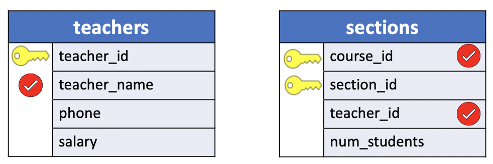
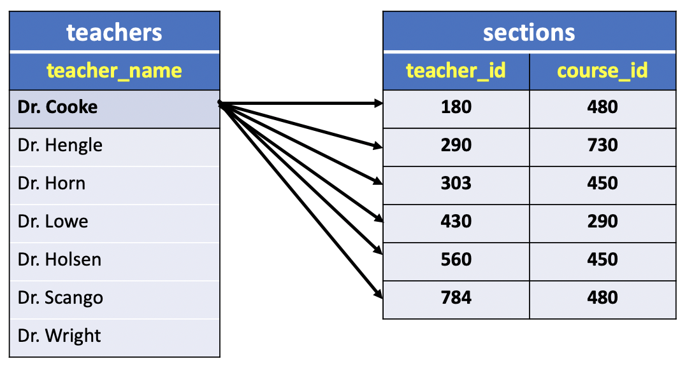
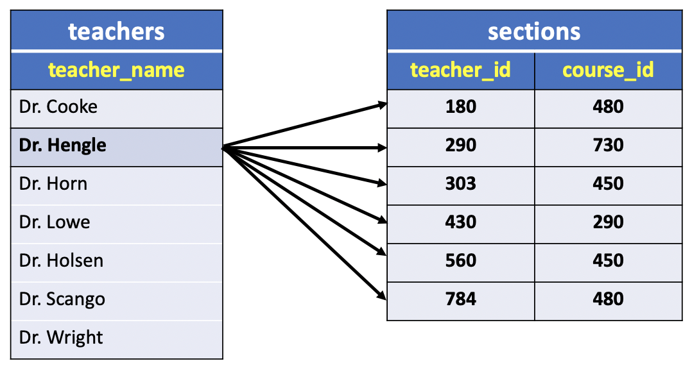
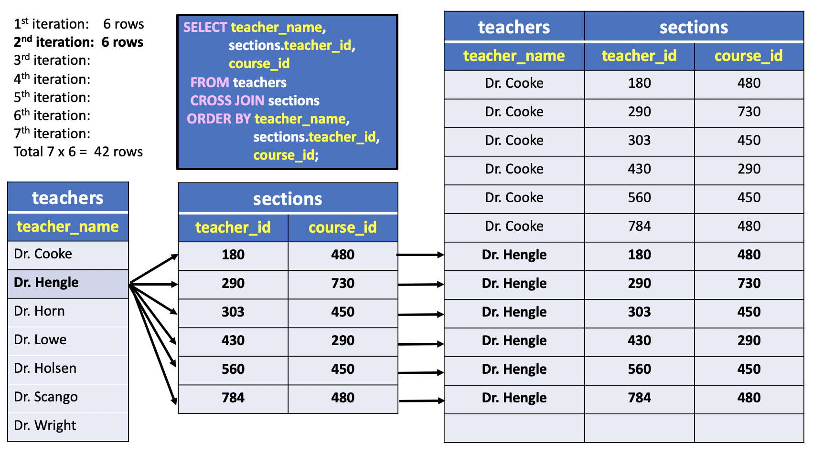

# What is a Join?

In the previous section, we introduced the notion of `qualified names` as a way to reference a table in a `SELECT` statement. We used this concept to formulate the following query:

**SQL**
```SQL
SELECT teacher_name,
       sections.teacher_id,
       course_id
  FROM teachers, sections;
```

Before executing the query, let's run the following two queries:

**SQL1**
```SQL
SELECT teacher_name
  FROM teachers
 ORDER BY teacher_name;
```

**SQL2**
```SQL
SELECT teacher_id,
       course_id
  FROM sections;
 ORDER BY teacher_id;
```


**Result1**

|teacher_name|
|:-----------:|
|Dr. Cooke|
|Dr. Engle|
|Dr. Horn|
|Dr. Lowe|
|Dr. Olsen|
|Dr. Scango|
|Dr. Wright|

(7 rows)

**Result2**

| teacher_id | course_id|
|:----------:|:--------:|
|        180 |       480|
|        290 |       730|
|        303 |       450|
|        430 |       290|
|        560 |       450|
|        784 |       480|

(6 rows)

In these two queries we did not filter the table's rows with a `WHERE` clause condition in the `SELECT` statement and, consequently, the results contain all the tables' rows. The results, therefore, return the total number of rows or records in the **teachers** and **sections** tables, that is `7` and `6` rows respectively. So if you issue the query:

**SQL**
```SQL
SELECT teacher_name,
       sections.teacher_id,
       course_id
  FROM teachers, sections
 ORDER BY teacher_name, sections.teacher_id, course_id;
```

what will come back in return?

**Query Diagram**


- **tables**: teachers, sections
- **columns**: `teacher_name`, **sections**.`teacher_id`, `course_id`


Obviously, the result will have three columns. But

- What values will be contained in those three columns? And
- How many rows will be in the Output?

The query does not have any filtering condition to restrict the number of rows in the output and, therefore, the values in the `teacher_name` column of **teachers** table must appear in the output as well as the values in the `teacher_id` and `course_id` columns of **sections** table.

Hence, we'd expect to see each value for `teacher_name` from **teachers** along with each possible value for `teacher_id` and `course_id` from **sections**.


**Query**
```console
uniy=# SELECT teacher_name,
uniy-#        sections.teacher_id,
uniy-#        course_id
uniy-#   FROM teachers, sections
uniy-#  ORDER BY teacher_name, sections.teacher_id, course_id;
```

To carry out this query, SQL will list values from each record of both tables.

**Results**

|    teacher_name    | teacher_id | course_id|
|:------------------:|:----------:|:--------:|
| Dr. Cooke          |        180 |       480|
| Dr. Cooke          |        290 |       730|
| Dr. Cooke          |        303 |       450|
| Dr. Cooke          |        430 |       290|
| Dr. Cooke          |        560 |       450|
| Dr. Cooke          |        784 |       480|
| **Dr. Engle**          |        **180** |      **480**|
| **Dr. Engle**          |        **290**|       **730**|
| **Dr. Engle**          |        **303** |      **450**|
| **Dr. Engle**          |        **430** |      **290**|
| **Dr. Engle**          |        **560** |      **450**|
| **Dr. Engle**          |        **784** |      **480**|
| Dr. Horn           |        180 |       480|
| Dr. Horn           |        290 |       730|
| Dr. Horn           |        303 |       450|
| Dr. Horn           |        430 |       290|
| Dr. Horn           |        560 |       450|
| Dr. Horn           |        784 |       480|
| **Dr. Lowe**           |        **180** |       **480**|
| **Dr. Lowe**           |        **290** |       **730**|
| **Dr. Lowe**           |        **303** |       **450**|
| **Dr. Lowe**           |        **430** |       **290**|
| **Dr. Lowe**           |        **560** |       **450**|
| **Dr. Lowe**           |        **784** |       **480**|
| Dr. Olsen          |        180 |       480|
| Dr. Olsen          |        290 |       730|
| Dr. Olsen          |        303 |       450|
| Dr. Olsen          |        430 |       290|
| Dr. Olsen          |        560 |       450|
| Dr. Olsen          |        784 |       480|
| **Dr. Scango**         |        **180** |       **480**|
| **Dr. Scango**         |        **290** |       **730**|
| **Dr. Scango**         |        **303** |       **450**|
| **Dr. Scango**         |        **430** |       **290**|
| **Dr. Scango**         |        **560** |       **450**|
| **Dr. Scango**         |        **784** |       **480**|
| Dr. Wright         |        180 |       480|
| Dr. Wright         |        290 |       730|
| Dr. Wright         |        303 |       450|
| Dr. Wright         |        430 |       290|
| Dr. Wright         |        560 |       450|
| Dr. Wright         |        784 |       480|

It follows that the total number of rows in the resulting table is given by the product of the total number of rows in the `teachers` and `sections` table.

- `7 * 6` = (**42 rows**)

In fact, the output shows all possible combinations of the selected columns from all records in the two tables.



In other words, the results begin with a line containing
- the value of `teacher_name` from the first record in **teachers** table,`Dr. Cook`, matched with the values of `teacher_id` and `course_id` from the first record in the **sections** table, `(180, 480)`.
  - (**Dr. Cook**) **->** (**180**,**480**)
- Next, comes a line matching the next `teacher_id` and `course_id` values, `(290, 730)`, with the selected value from the first record in the **teachers** table,
  - (**Dr. Cook**) **->** (**290**, **730**)
- and so on, until each records in the **sections** table has been matched with the first **teachers** record.



Next, the results contain a series of lines that match the selected value from the second record in the **teachers** table, `Dr. Hengle`, with the `teacher_id` and `course_id` values from every record in the **sections** table, and so on.

The result of this seemingly simple query is a long list of combinations, each consisting of a value from a record in **teachers** paired with two values from a record in **sections**.

In relational database theory, this long list of combinations is called a **cross join**, or even more technically a **Cartesian product**.

**Cross joins** are used fairly rarely, but they can be useful in some situations for testing results or other tasks as we'll see in the next lesson. (Most often, however, they're produced by accident :smile:)

We illustrate the use of the **CROSS JOIN** clause more closely in the next lesson.

## JOIN Definition

So, **what is a join or joined table ?**

A **joined table** is a table derived from two other tables (real or derived), `t1` and `t2`, according to the `rules` of a particular **join type**.




In a **CROSS JOIN** `type`, a **joined table** is a table derived from two other tables, `t1` and `t2`, containing every possible combination of rows from `t1` and `t2`.

Each combination `row` in the resulting table consists of all columns in `t1` followed by all columns in `t2`, indicated in the query's `SELECT` statement. Obviously, the order of columns in the results does not matter but what really matters is the number of columns or fields (row's values) in the resulting row.

Now, hopefully :smile:, should be clear the meaning of **join** or **joined table**.

As its name suggests, a **JOIN** means that some or all of the specified row's contents of two tables (i.e the tables's fields or cells for spreadsheets users :smile:), are joined together in the results' row of the query.
