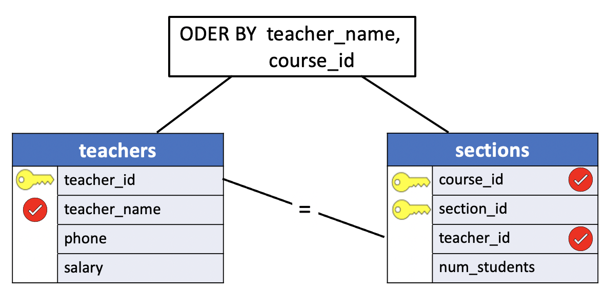

# Query Diagrams for Joins

The visual approach to SQL really comes into its own when depicting joins.

In this lesson we illustrate how to depict a **Query Diagram** for the JOIN operation.

The columns from the tables being joined, such as **teachers**.`teacher_id` and **sections**.`teacher_id` illustrated in the previous [lesson](./05_where_join.md), are indicated by a line connecting them.

This line is marked with the operator used in the `WHERE` clause (typically an equals sign). For more complex joins involving more than two tables, several such connecting lines will exist between tables.

Joins can get complicated. By first thinking of (or actually drawing) the query visually, this complexity becomes manageable.

## Example: A join with a simple WHERE clause and ORDER BY


**Problem**: Which teachers teach which courses? (List the teachers by name and course_id)


- **Tables**: teachers, sections
- **Columns**: teacher_name, course_id
- **Condition**: teachers.teacher_id = sections.teacher_id
- **Sorting**: teacher_name, course_id


**Query Diagram Join**  



**SQL**
```SQL
SELECT teacher_name,
       course_id
  FROM teachers, sections
 WHERE teachers.teacher_id = sections.teacher_id
 ORDER BY teacher_name, course_id;
```

**Results**

|teacher_name    | course_id|
|:--------------:|:---------:|
|Dr. Cooke          |       480|
|Dr. Engle          |       290|
|Dr. Horn           |       450|
|Dr. Lowe           |       730|
|Dr. Olsen          |       450|
|Dr. Scango         |       480|


> NOTE: If we were willing to settle for identifying teachers solely by their `teacher_id`, no join would be required. The `sections` table alone contains enough informtion to answer that question. By requesting the `names` of teachers, however, we also request a join, because teacher names and course numbers are not stored in the same table.
