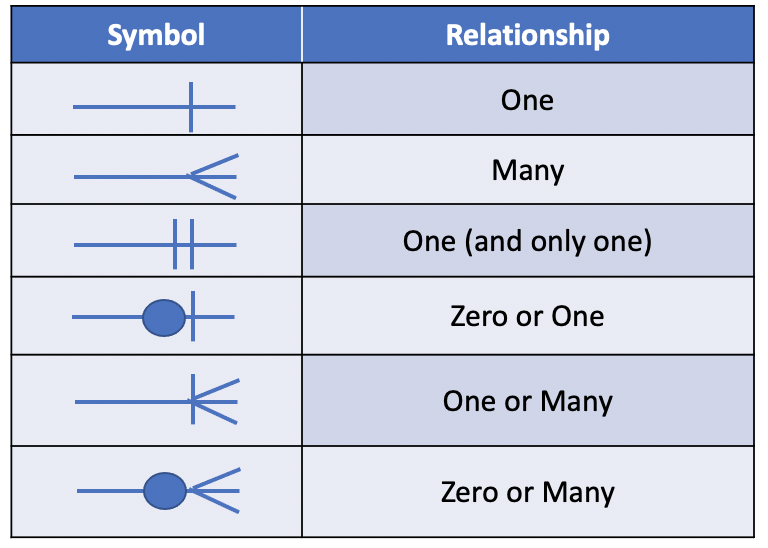
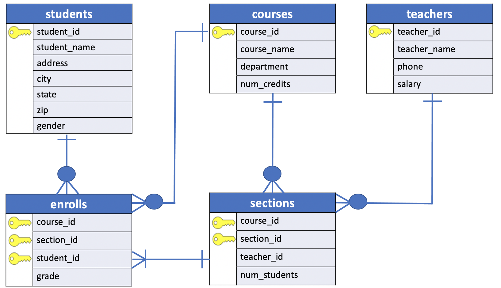
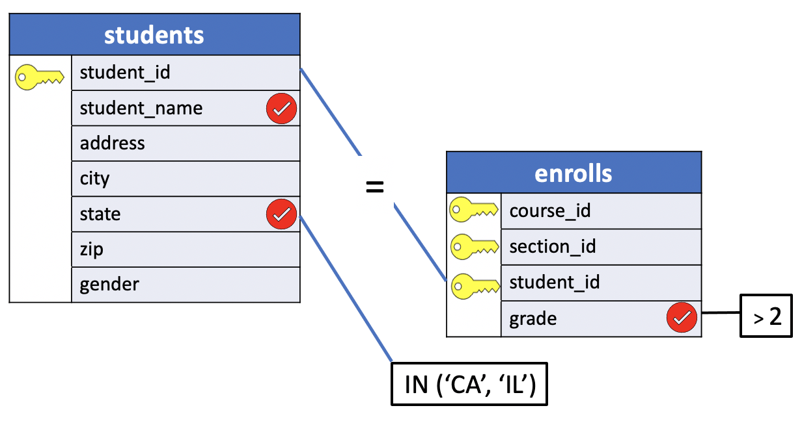
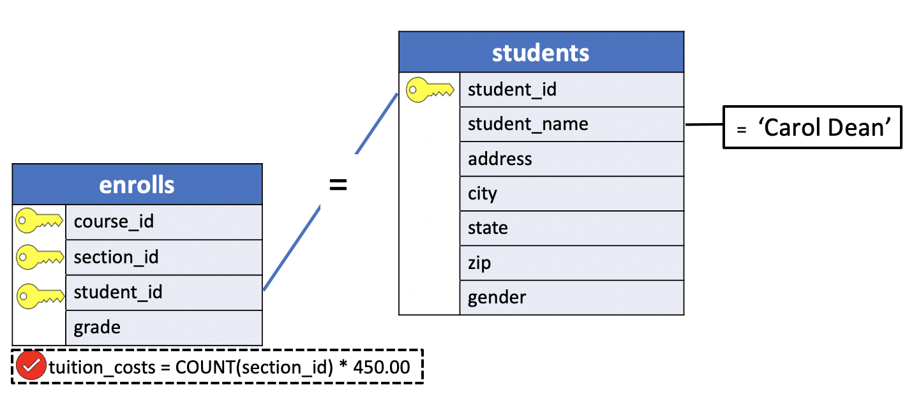

# Joining Tables Using the JOIN Operator

In the inital versions of the SQL language, joins could only be created using the `WHERE` clause, and this syntax is still supported in SQL-92. This newer version, however, also introduces a new explicit **JOIN** `operator`.


## PostgreSQL joins

PostgreSQL join is used to combine columns from one (`self-join`) or more tables based on the values of the common columns between related tables. The common columns are typically the primary key columns of the first table and foreign key columns of the second table.

PostgreSQL supports `inner join`, `left join`, `right join`, `full outer join`, `cross join`, `natural join`, and a special kind of join called `self-join`.

In this lesson we introduce the **INNER JOIN** clause.


## PostgreSQL INNER JOIN

To query data from two or more related tables, you use the **INNER JOIN** clause. The following statement illustrates how to join two tables `T1` and `T2`.

```SQL
SELECT *
FROM T1 INNER JOIN T2
ON join_predicate;
```

Let’s examine the statement above in detail:

- First, specify the main table in the `FROM` clause, `T1` in this case.
- Second, specify the joined table in the `INNER JOIN` clause followed by the `ON` keyword. The joined table is `T2` in the above statement.
- Third, a `join predicate` specifies the condition for joining tables. **Only rows that satisfy the join predicate are included in the result set**.

The query returns a result set by combining column values of both tables `T1` and `T2` **based on the join predicate**.

It compares each row of table `T1` with rows of table `T2` to find all pairs of rows that satisfy the join predicate. Whenever the **join predicate is satisfied by matching** `non-NULL values`, column values for each matching pair of rows of `T1` and `T2` tables are combined into a row in the result set.

Since the `INNER JOIN` is commutative, the previous query is equivalent to:

```SQL
SELECT *
FROM T2 INNER JOIN T1
ON join_predicate;
```


Compare the previous query to the syntax using the `WHERE` clause:

```SQL
SELECT *
  FROM T2, T1
 WHERE join_predicate;
```

The two tables in the example are combined with the operator **INNER JOIN**, and the `WHERE` clause is replaced by an `ON` clause. An **INNER JOIN** is the most common type of join. It returns only those records from each table that match the criteria specified in the `ON` clause.

> Note: In the following the terms `column` and `variable` have the same meaning. A `column` and a `variable` is a set of values.


## Understanding INNER JOIN

In lesson [5](.05_where_join.md), we introduced the **INNER JOIN** operator as a way to select a `subset of rows` in the **CROSS JOIN** resulting table.

To help you learn how inner join works, I'm going to use the tables of the `CROSS JOIN` example presented in lesson [4](./04_cross_join.md). This time, however, we include two additional columns for the primary and foreign keys of the parent and child tables, respectively.


In this picture, the first column in the A and B tables represents the "**primary key**" (**pk**) and "**foreign key**" (**fk**) variables. These variables are used to **match** the rows between the tables.

To help you visualize a match between tables each distinct value in these columns have a colour (**100** = `green`, **200** = `pink`, **300** = `orange`). On the other hand, the grey colour is used to represent the values in the other column that is carried along for the ride. This example uses a table with a single key and column but it can be easily generalized to composite keys and multiple column values.

In this example,
- the **fk** column in table `B` references the `A` table using the **pk** column.
- the **pk** column or variable uniquely identifies a row in table `A` and
- the **fk** column or variable uniquely identifies a row in table `A`. In other word, the values in this column are a subset of the values in the **pk** column.

In these definitions emerge an important connection between the values of the primary and foreign key variables. This connection or **join** is basically a **mapping** between a **primary key value** or **row** (a row is uniquely identified by it's primary key value) in the `A` table to `zero`, `one` or `more` **rows** in the `B` table, depending on the `foreign key value`.

For example, the primary key values in column `pk` of table A:

- **100** is mapped to `one` row in table `B`
- **200** is mapped to `two` rows in table `B`
- **300** is mapped to `zero` rows in table `B`.  

Lastly, assuming that the foreign key column dose not allow `NULL` values, the referential integrity constraint enforces each record in the child table `B` to have a matching row in the parent table `A`. Consequently, the values of the `fk` columns will be in the results of the `INNER JOIN`.

There are, therefore, three types of `primary-foreign` keys mapping:

| A-B Mapping| Meaning |
|:----------:|:-------:|
|`one`-TO-**zero**| A row in the parent table A does not have a matching row (`zero`) in the child table B|
|`one`-TO-**one**| A row in the parent table A has `one` matching row in the child table B|
|`one`-TO-**many**| A row in the parent table A has two or `more` matching rows in the child table B|


There are, therefore, 5 basic relationships that indicate the cardinality between tables in an ERD. In the picture below the `One` and `One(and only one)` can be grouped together in `One(and only one)` for simplicity.



Each mapping establishes an implicit function between two sets, `A`and `B`. The function `B`**->**`A` is a mapping between the primary key values in the `B` table and the primary key values in the `A` table, based on the foreign key values.

The relationship in the picture above can be summarized in four types of function:

|Relationship|function|
|:----------:|:------:|
|One(and only one)| bijective, (injective and surjective)|
|Zero or One| injective|
|One or Many, Many| surjective|
|Zero or Many| Not injective and Not surjective|


## PostgreSQL INNER JOIN examples



### Problem 1

1. **Problem**: Which teachers teach which courses? (List the teachers by name and course_id)


- **Tables**: teachers, sections
- **Columns**: teacher_name, course_id
- **Condition**: `teachers.teacher_id = sections.teacher_id`
- **Sorting**: teacher_name, course_id

```console
uniy=# \d sections
                 Table "public.sections"
    Column    |   Type   | Collation | Nullable | Default
--------------+----------+-----------+----------+---------
 course_id    | smallint |           | not null |
 section_id   | smallint |           | not null |
 teacher_id   | smallint |           |          |
 num_students | smallint |           |          |
Indexes:
    "sections_pkey" PRIMARY KEY, btree (course_id, section_id)
Foreign-key constraints:
    "sections_fkey_course" FOREIGN KEY (course_id) REFERENCES courses(course_id) ON DELETE CASCADE
    "sections_fkey_teacher" FOREIGN KEY (teacher_id) REFERENCES teachers(teacher_id) ON DELETE SET NULL
Referenced by:
    TABLE "enrolls" CONSTRAINT "enrolls_fkey_section" FOREIGN KEY (course_id, section_id) REFERENCES sections(course_id, section_id) ON DELETE CASCADE
```

**Query Diagram Join**  


**SQL**
```SQL
SELECT teacher_name,
       course_id
  FROM teachers INNER JOIN sections
    ON teachers.teacher_id = sections.teacher_id
 ORDER BY teacher_name, course_id;
```

**Results**

|teacher_name    | course_id|
|:--------------:|:---------:|
|Dr. Cooke          |       480|
|Dr. Engle          |       290|
|Dr. Horn           |       450|
|Dr. Lowe           |       730|
|Dr. Olsen          |       450|
|Dr. Scango         |       480|

**Query**

```console
uniy=# SELECT teacher_name,
uniy-#        course_id
uniy-#   FROM teachers INNER JOIN sections
uniy-#     ON teachers.teacher_id = sections.teacher_id
uniy-#  ORDER BY teacher_name, course_id;
```

**Output**
```console
    teacher_name    | course_id
--------------------+-----------
 Dr. Cooke          |       480
 Dr. Engle          |       290
 Dr. Horn           |       450
 Dr. Lowe           |       730
 Dr. Olsen          |       450
 Dr. Scango         |       480
(6 rows)
```


### Problem 2

2. **Problem**: Which students from California or Illinois got As or Bs?

- **Tables**: students, enrolls
- **Columns**: student_name, state, grade
- **Condition**:
  - (join) `students.student_id = enrolls.students_id`
  - students from California or Illinois
  - got grade As or Bs

```console
uniy=# \d enrolls
                 Table "public.enrolls"
   Column   |   Type   | Collation | Nullable | Default
------------+----------+-----------+----------+---------
 course_id  | smallint |           | not null |
 section_id | smallint |           | not null |
 student_id | smallint |           | not null |
 grade      | smallint |           |          |
Indexes:
    "enrolls_pkey" PRIMARY KEY, btree (course_id, section_id, student_id)
Foreign-key constraints:
    "enrolls_fkey_course" FOREIGN KEY (course_id) REFERENCES courses(course_id) ON DELETE CASCADE
    "enrolls_fkey_section" FOREIGN KEY (course_id, section_id) REFERENCES sections(course_id, section_id) ON DELETE CASCADE
    "enrolls_fkey_student" FOREIGN KEY (student_id) REFERENCES students(student_id) ON DELETE CASCADE
```

**Query Diagram**


**SQL**

```SQL
SELECT student_name,
       state,
       grade
  FROM students INNER JOIN enrolls
    ON students.student_id = enrolls.student_id
 WHERE state IN ('CA', 'IL') AND
       grade > 2;
```

**Results**

|student_name    | state | grade|
|:--------------:|:-----:|:-----:|
|Val Shipp          | IL    |     3|


**Query**

```console
uniy=# SELECT student_name,
uniy-#        state,
uniy-#        grade
uniy-#   FROM students INNER JOIN enrolls
uniy-#     ON students.student_id = enrolls.student_id
uniy-#  WHERE state IN ('CA', 'IL') AND
uniy-#        grade > 2;
```

**Output**

```console
    student_name    | state | grade
--------------------+-------+-------
 Val Shipp          | IL    |     3
(1 row)
```

### Problem 3

3. **Problem**: Assuming that tuition is $450 per course, what is Carol Dean's total tuition bill?

- **Tables**: students, enrolls
- **Columns**: `tuition_costs` -> number of courses x $450
- **Condition**:
  - (join) `students.student_id = enrolls.students_id`
  - student's name Carol Dean

```console
uniy=# \d enrolls
                 Table "public.enrolls"
   Column   |   Type   | Collation | Nullable | Default
------------+----------+-----------+----------+---------
 course_id  | smallint |           | not null |
 section_id | smallint |           | not null |
 student_id | smallint |           | not null |
 grade      | smallint |           |          |
Indexes:
    "enrolls_pkey" PRIMARY KEY, btree (course_id, section_id, student_id)
Foreign-key constraints:
    "enrolls_fkey_course" FOREIGN KEY (course_id) REFERENCES courses(course_id) ON DELETE CASCADE
    "enrolls_fkey_section" FOREIGN KEY (course_id, section_id) REFERENCES sections(course_id, section_id) ON DELETE CASCADE
    "enrolls_fkey_student" FOREIGN KEY (student_id) REFERENCES students(student_id) ON DELETE CASCADE
```

**Query Diagram**



**SQL**

```SQL
SELECT COUNT(section_id) * 450.00 AS tuition_costs
  FROM enrolls INNER JOIN students
    ON enrolls.student_id = students.student_id
 WHERE student_name = 'Carol Dean';
```

**Results**

|tuition_costs|
|:------------:|
|      1350.00|


**Query**
```console
uniy=# SELECT COUNT(section_id) * 450.00 AS tuition_costs
uniy-#   FROM enrolls INNER JOIN students
uniy-#     ON enrolls.student_id = students.student_id
uniy-#  WHERE student_name = 'Carol Dean';
```

**Output**
```console
 tuition_costs
---------------
       1350.00
(1 row)
```
