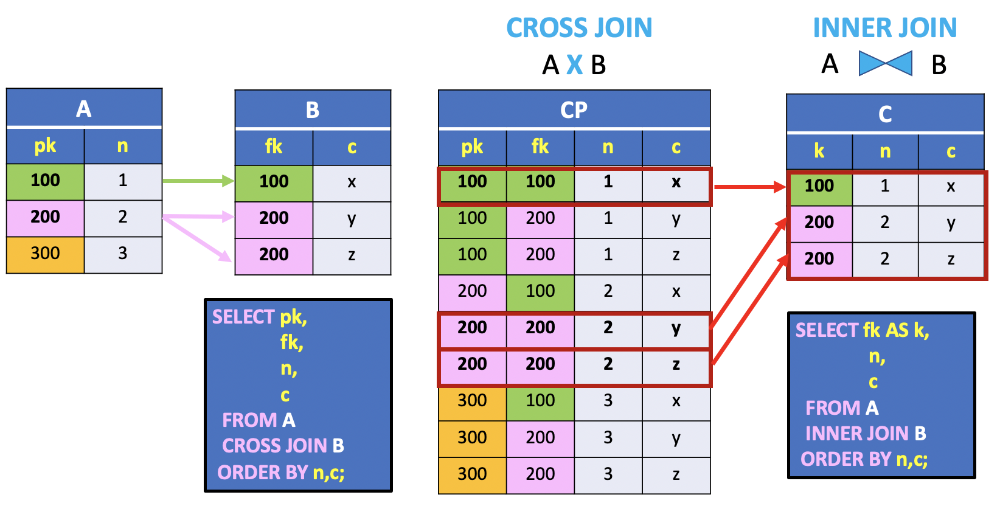

# JOIN Visual Diagram

In lesson [4](./04_cross_join.md) of this chapter, we proposed an alternative and more informative representation of the **Cartesian Product** for the **CROSS JOIN** of two tables. The picture below illustrates the **CROSS JOIN** example presented in lesson [4](./04_cross_join.md). For an in depth discussion please refer to [04_cross_join.md](./04_cross_join.md).

Moreover, we introduced the **INNER JOIN** operator as a way to select a `subset of rows` in the **CROSS JOIN** resulting table.

In the next sections, we extend this visual representation by including the tables **keys** values and the **relationship** between those values. This visual representation is helpful to understand the different types of join: `inner join`, `left join`, `right join`, `full outer join`, `cross join`, `natural join`.

In this lesson we discuss the **INNER JOIN** type.

Fasten your seat belt and stay tuned :smile:

> Note: In the following the terms `column` and `variable` have the same meaning. A `column` and a `variable` is a set of values.

## INNER JOIN Visual Diagram

In the preceding sections and chapters of this course, we have seen that a Relational Database is essentially a Model **based on the values of the common columns** between `related tables`.

The common columns, used to connect each pair of tables are typically the **primary key** columns of the first table and the **foreign key** columns of the second table.

To help you learn how join works, I'm going to use a visual representation similar to the one used for the example of lesson [4](./04_cross_join.md). This time, however, we include two additional columns for the primary and foreign keys of the parent and child tables, respectively.

The `INNER JOIN` example is the one discussed in the previous lesson [inner join](./07_inner_join). For a quick reference, the example tables and the `INNER JOIN` results are illustrated below.

