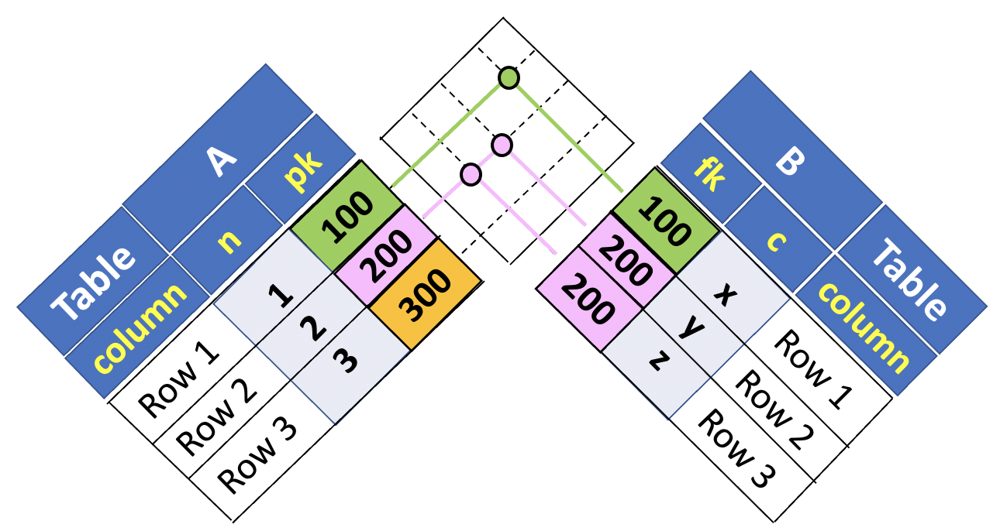
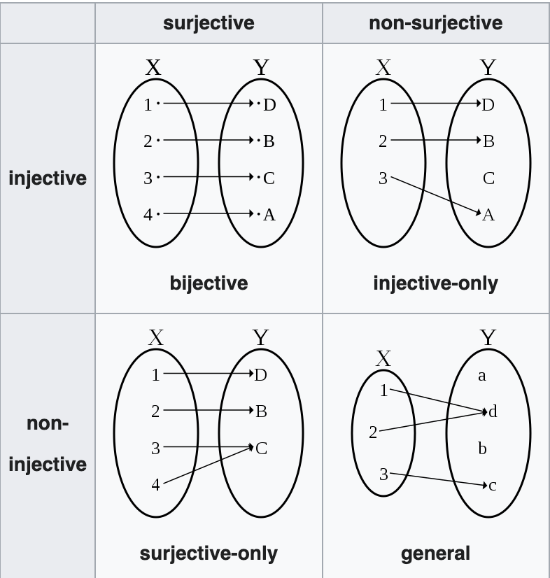
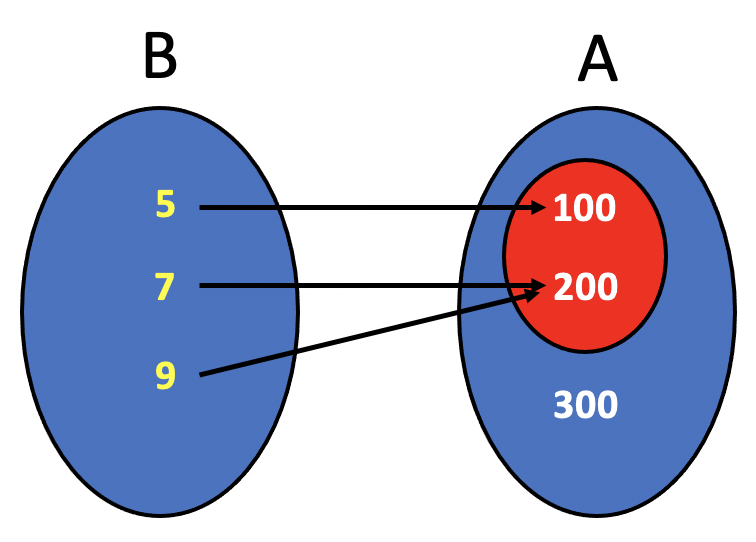
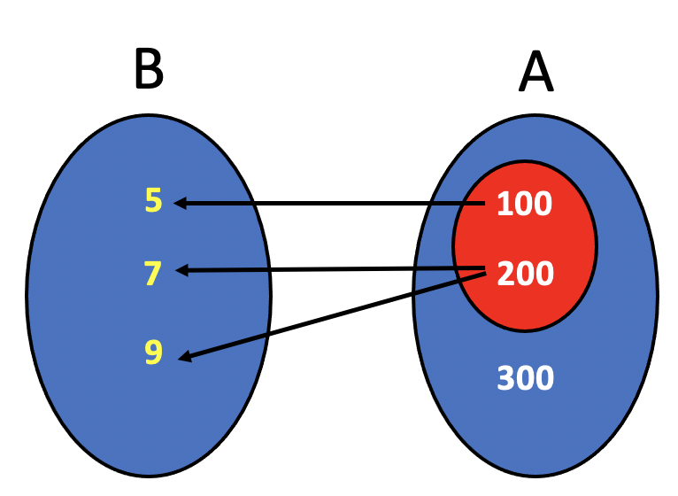
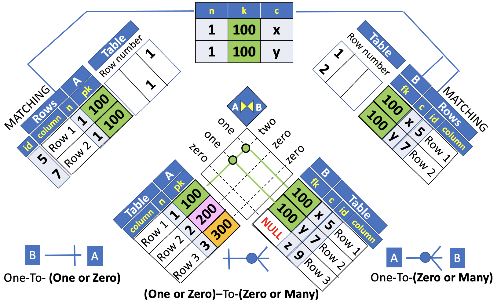
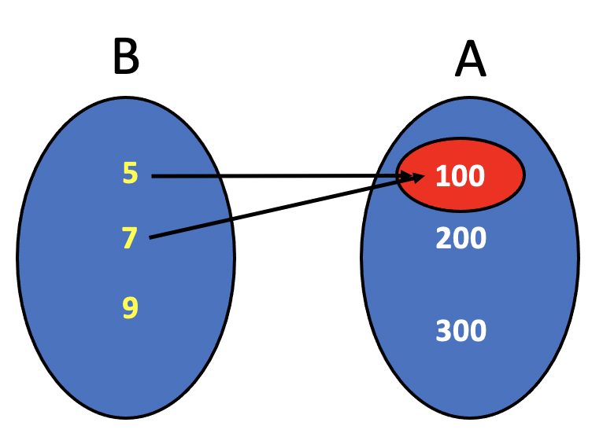
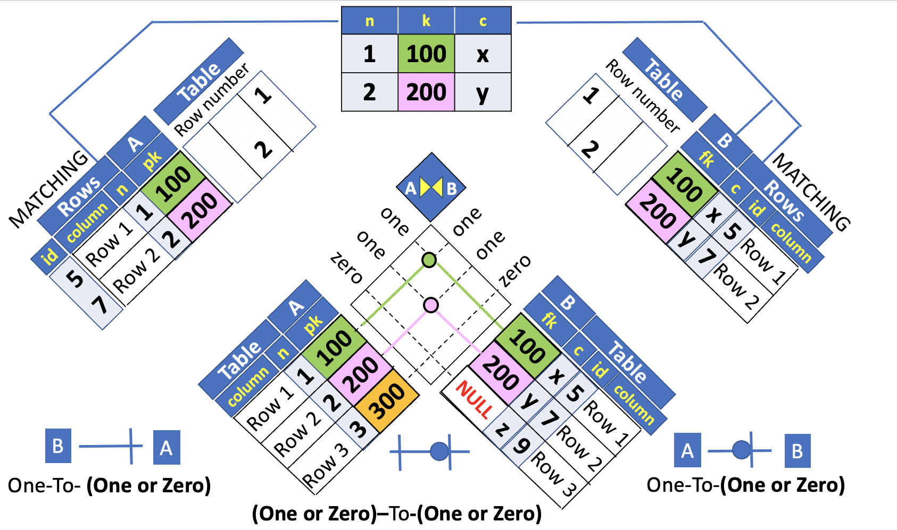

# JOIN Visual Diagram

In lesson [4](./04_cross_join.md) of this chapter, we proposed an alternative and more informative representation of the **Cartesian Product** for the **CROSS JOIN** of two tables. The picture below illustrates the **CROSS JOIN** example presented in lesson [4](./04_cross_join.md). For an in depth discussion please refer to [04_cross_join.md](./04_cross_join.md).


Moreover, we introduced the **INNER JOIN** operator as a way to select a `subset of rows` in the **CROSS JOIN** resulting table.

In the next sections, we extend this visual representation by including the tables **keys** values and the **relationship** between those values. This visual representation is helpful to understand the different types of join: `inner join`, `left join`, `right join`, `full outer join`, `cross join`, `natural join`.

In this lesson we discuss the **INNER JOIN** type.

Fasten your seat belt and stay tuned :smile:

> Note: In the following the terms `column` and `variable` have the same meaning. A `column` and a `variable` is a set of values.

## JOIN Visual Diagram Representation

In the preceding sections and chapters of this course, we have seen that a Relational Database is essentially a Model **based on the values of the common columns** between `related tables`.

The common columns, used to connect each pair of tables are typically the **primary key** columns of the first table and the **foreign key** columns of the second table.

To help you learn how join works, I'm going to use a visual representation similar to the one used for the example of lesson [4](./04_cross_join.md). This time, however, we include two additional columns for the primary and foreign keys of the parent and child tables, respectively.

The example tables that will be used to illustrate the visual representation of a join are borrowed from the `INNER JOIN` example discussed in the previous lesson [inner join](./07_inner_join). For a quick reference, the example tables and the `INNER JOIN` results are illustrated below. For an in depth discussion please refer to lesson [inner join](./07_inner_join).


In this picture each row in table `A` is matched with `zero`, `one` or `more` rows in table `B` based on the values of the primary and foreign key columns.

The following diagram shows each `potential match` as an `intersection of pair dotted lines`.


If you look closely, you might notice that we've switched the order of the primary key `pk` and `n` columns in table **A**. This is to emphasise that **joins match based on the key**; the values in the other columns are just carried along for the ride.




In this diagram each dot, indicated as the intersection of a pair of coloured lines linked to each row, represents a match. To be precise, in this example the keys are the `primary` and `foreign` key columns in `A` and `B` tables, indicated as **pk** and **fk** in the picture above. The number of dots in the picture, therefore, is basically the number of matches.


## INNER JOIN Visual Diagram


An **INNER JOIN** matches pairs of rows or observations whenever their key are equal. To be precise, this is an **equi-join** (definition borrowed by relational algebra) because the keys are matched using the equality operator.

**SQL**
```SQL
SELECT n,
       fk as k,
       c
  FROM A INNER JOIN B
    ON A.pk = B.fk
 ORDER BY n,c;
```

In this example, the keys are the `primary` and `foreign` key columns in `A` and `B` tables, indicated as **pk** and **fk** in the SQL query.


To better understand the **referential integrity constraint mapping**, we included a surrogate primary key column (`id`) in table `B`. Each row in table `B` is, therefore, uniquely identified by the `id` column values. Similarly, each row in table `A` is uniquely identified by the `pk` column values.

For example, the primary key values in column `id` of table B:

- **5** uniquely identifies `ROW 1`.
- **7** uniquely identifies `ROW 2`.
- **9** uniquely identifies `ROW 3`.

And the primary key values in column `pk` of table A:

- **100** uniquely identifies `ROW 1`.
- **200** uniquely identifies `ROW 2`.
- **300** uniquely identifies `ROW 3`.

In the picture above, the values in the `pk` column of table `A` are mapped to `zero`, `one` and `more` rows in the `B` table, depending on the foreign key value.

For example, the primary key values in column `pk` of table A:

- **100** is mapped to `one` row in table `B`, `ROW 1` or **5**.
- **200** is mapped to `two` rows in table `B`, `ROW 2` and `ROW 3`,or **7** and **9**.
- **300** is mapped to `zero` rows in table `B`. No ROWS.

Consequently, the primary key values in column `id` of table B:

- **5** is mapped to **100**
- **7** is mapped to **200**
- **9** is mapped to **200**

As a result, all the rows in table `B` will be in the inner join resulting table, indicated as `Matching Rows Table B` on the top right hand side of the picture. It follows that the values in the `id` column of table `B` uniquely identify each matching row in the inner join resulting table.

It follows that the set of `Matching Rows in Table A`, indicated on the top left hand side of the picture, is also defined in terms of the values in the `id` column of table `B`, indicated on the left hand side. For instance, the value **5** identifies the first matching  linked to the value **100** in the pk column of table `A` and the values **7** and **9** identify the second and third matching linked to the value **200**.

As a result, those values are implicitly mapped to the primary key values of the `A` table. This implicit mapping defines a **function**.

This implicit mapping was first mentioned in the previous [lesson](./07_inner_join.md) and classified in 4 different functions.

|Relationship|function|
|:----------:|:------:|
|One(and only one)| bijective, (injective and surjective)|
|Zero or One| injective|
|One or Many, Many| surjective|
|Zero or Many| Not injective and Not surjective|

The following picture illustrates the different categories. For a quick reference see the definitions in this [link](https://en.wikipedia.org/wiki/Bijection,_injection_and_surjection).



In the next section we discuss the 4 types of functions and the implication for the cardinality of the `INNER JOIN` resulting tables.

## INNER JOIN CARDINALITY

For the sake of clarity we remind the definition of function between two sets. This trivial introduction, (might be boring for somebody :smile:), is essential for understanding the relational model mapping.

A **function** between two sets is a **rule** that assigns to each member in the first set (called the *domain*) **ONE AND ONLY ONE** member in the second set (called the *range*). Intuitively, a function is an operation that takes an `INPUT` and produces an `OUTPUT` based on the input.

In relational algebra or Relational Database, the functions we are interested are functions that take primary key values in the child table as `INPUT`, and gives primary key values in the parent table as `OUTPUT`.

### (One and Only One) TO (Zero or Many): General function


An example of a simple function for the `INNER JOIN` between tables `B` (**INPUT**) and `A` (**OUTPUT**) illustrated in the picture above is given below.

- **f**: `B`**->**`A`

|INPUT|OUTPUT|
|:---:|:----:|
|5|100|
|7|200|
|9|200|



In this example, the domain of **f** is the set `B` **=** `{5, 7, 9}` and the range of **f** is the set `f(B)`**=** `{100,200}`. Moreover, for each value in set `B` there is **one and only one** value in set `A`. This function falls in the general case.

In order for an operator to be a valid function, each input must produces one and only one output. However, it is valid for a function to produce the same output with different inputs. Notice in the above example that **f** gives `200` as output for both the inputs `7` and `9` which still makes **f** a function. This result excludes the possibility of **f** to be an `injective` function. We also notice that **f** does not map any value in `B` to `300` in `A`. This excludes the possibility of **f** to be a `surjective` function. It follows that **f** falls in the general case.

On the other hand, the mapping between the primary key `A` and `B` is not a function.

- **r**: `A`**->**`B`

|INPUT|OUTPUT|
|:---:|:----:|
|100|5|
|200|7|
|200|9|
|300|NULL|




In this example, the input `200` has two outputs, `7` and `9`. We clearly see that this table defines a **Zero or Many** mapping.

Following the definition of table `B` given in the previous lesson:

**SQL**
```SQL
CREATE TABLE b (
  id SMALLINT PRIMARY KEY,
  c CHAR,
  fk SMALLINT NOT NULL
  CONSTRAINT b_fkey_a
     FOREIGN KEY (fk)
     REFERENCES A (pk)
     ON DELETE CASCADE
);
```

It's straightforward to tell the number of rows for the `INNER JOIN` operation. We notice that the `fk` column does not allow `NULL` values and therefore all the rows of `B` will be in the output.

|rows in A| NOT NULL rows in B| NULL rows in B| A -> B| B -> A| function| rows in Inner Join(A,B)|
|:-------:|:--------:|:-----:|:----:|:-----:|:-----:|:---:|
|n|m|0|Zero or Many|One and only One|general|m|

It follows that an `INNER JOIN` between the parent and child tables, `A` and `B`, returns a number of rows equal to the number of rows in the child table `B`.

The **Zero or Many** and **One and only One** mapping, indicated as `A->B` and `B->A` in the table above, define a `general` function. It follows that an `INNER JOIN` between the parent and child tables and a **One and only One** `To` **Zero or Many** relationship returns a number of rows equal to the number of rows in the child table `B`.

### (Zero Or One) TO (Zero or Many): General function

In this section we examine the case a child table `B` allows `NULL` values in the foreign key column.

**SQL**
```SQL
CREATE TABLE b (
  id SMALLINT PRIMARY KEY,
  c CHAR,
  fk SMALLINT
  CONSTRAINT b_fkey_a
     FOREIGN KEY (fk)
     REFERENCES A (pk)
     ON DELETE CASCADE
);
```



> In the picture the Row label for the second record in the table on the top left hand side is Row 1.

In this example the function for the `INNER JOIN` between tables `B` (**INPUT**) and `A` (**OUTPUT**) is given below.

- **f**: `B`**->**`A`

|INPUT|OUTPUT|
|:---:|:----:|
|5|100|
|7|100|
|9|NULL|



In this example, the domain of **f** is the set `B` **=** `{5, 7, 9}` and the range of **f** is the set `f(B)`**=** `{100,100,NULL}`.

What is `NULL` for a function?

The definition of `NULL` in a relational database is `undefined` or `missing` value. Similarly, in mathematics the notion of `NULL` is equivalent to `NAN`, standing for Not A Number. NAN is a **member** of a numeric data type that can be interpreted as a value that is undefined or to represent missing values in computations.

In this example, the value `9` in set `B` is assigned to `NULL`. The value `9` is, therefore, not assigned to anything. You could say that there is a **zero or one** mapping for the function f. We also notice that **f** gives `100` as output for both the inputs `5` and `7`. This result excludes the possibility of **f** to be an `injective` function. We also notice that **f** does not map any value in `B` to `200` and `300` in `A`. This excludes the possibility of **f** to be a `surjective` function. It follows that **f** falls in the general case.

Since the `NULL` value cannot be matched to any value, the number of matching rows is equal to the number of `NOT NULL` rows in the child table.

|rows in A| NOT NULL rows in B| NULL rows in B| A -> B| B -> A| function| rows in Inner Join(A,B)|
|:-------:|:--------:|:-----:|:----:|:-----:|:-----:|:---:|
|n|m|k|Zero or One|One and only One|general|m|

It follows that an `INNER JOIN` between the parent and child tables, `A` and `B`, returns a number of rows equal to the number of `NOT NULL` rows in the child table `B`.

The **Zero or Many** and **Zero or One** mapping, indicated as `A->B` and `B->A` in the table above, define a `general` function. It follows that an `INNER JOIN` between the parent and child tables and a **Zero or One** `To` **Zero or Many** relationship returns a number of rows equal to the number of `NOT NULL` rows in the child table `B`.

### (Zero or One) TO (Zero or One): Injective function

In this section we examine the case a child table `B` allows `NULL` values in the foreign key column and dose not allow duplicates.

**SQL**
```SQL
CREATE TABLE b (
  id SMALLINT PRIMARY KEY,
  c CHAR,
  fk SMALLINT UNIQUE
  CONSTRAINT b_fkey_a
     FOREIGN KEY (fk)
     REFERENCES A (pk)
     ON DELETE CASCADE
)
```



In this example the function for the `INNER JOIN` between tables `B` (**INPUT**) and `A` (**OUTPUT**) is given below.

- **f**: `B`**->**`A`

|INPUT|OUTPUT|
|:---:|:----:|
|5|100|
|7|200|
|9|NULL|

In this example, the value `9` in set `B` is assigned to `NULL`. The value `9` is, therefore, not assigned to anything. You could say that there is a **zero or one** mapping for the function f. We also notice that distinct values in `B` are mapped to distinct values in `A`. It follows that **f** is an `injective` function. We also notice that **f** does not map any value in `B` to `300` in `A`. This excludes the possibility of **f** to be a `surjective` function. It follows that **f** falls in the `injective` case.

|rows in A| NOT NULL rows in B| NULL rows in B| A -> B| B -> A| function| rows in Inner Join(A,B)|
|:-------:|:--------:|:-----:|:----:|:-----:|:-----:|:---:|
|n|m|k|Zero or One|Zero or One|injective|m|


### Relationship cardinality table


The analysis of the previous cases can be easily extended to the other relationships. The table below gives a summary of the `INNER JOIN` cardinality of two tables.

|rows in A| NOT NULL rows in B| NULL rows in B| A -> B| B -> A| function| rows in Inner Join(A,B)|
|:-------:|:--------:|:-----:|:----:|:-----:|:-----:|:---:|
|n|m|0|Zero or Many|One and only One|general|m|
|n|m|k|Zero or Many|Zero or One|general|m|
|n|m|0|Zero or One|One and only One|injective|m|
|n|m|k|Zero or One|Zero or One|injective|m|
|n|m|0|One and only One|One and only One|bijective|m=n|
|n|m|k|One and only One|Zero or One|injective|m|
|n|m|0|One or Many|One and only One|surjective|m|
|n|m|k|One or Many|Zero or One|general|m|
|n|m|0|Many|One and only One|surjective|m|
|n|m|k|Many|Zero or One|general|m|


The table above shows that the number of rows in an `INNER JOIN` is equal to the number of `NOT NULL` values in the foreign key column in the child table.
