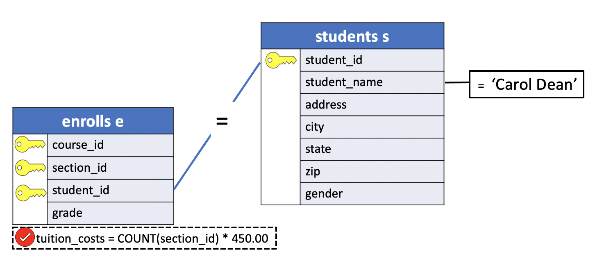
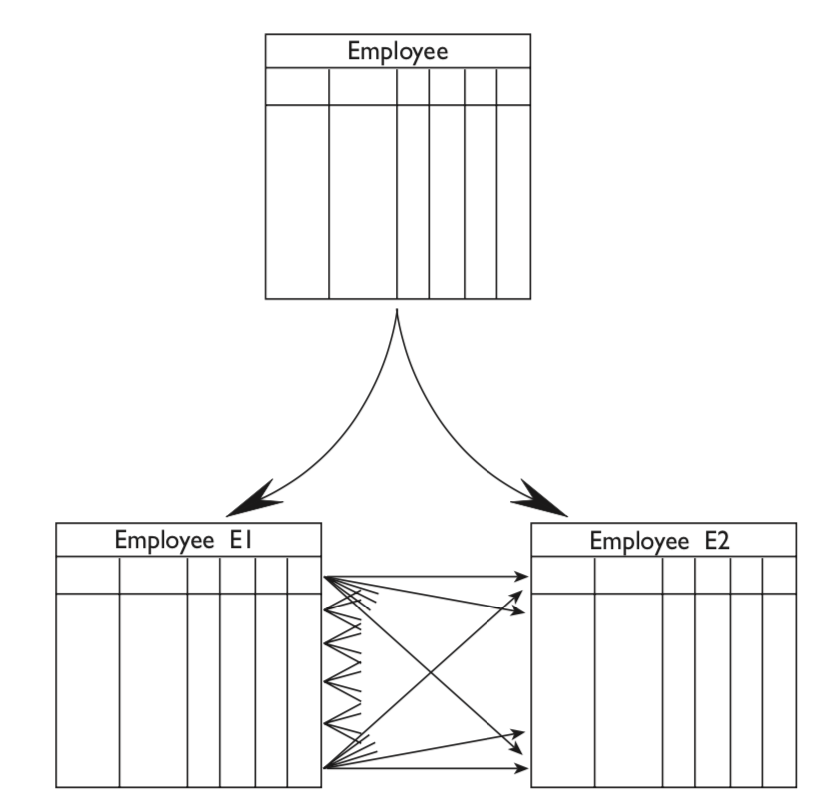

# Tables Aliases

In lesson [13](../01_basic_sql/13_derived_column_op_alias.md) we introduced the notion of `column alias` as a way to assign a column or an expression in the select list of a `SELECT` statement a temporary name. Similarly, we can assign **aliases to tables**.


## Why Tables Aliases?

Every table in a database must have a unique name. Sometimes it's useful to assign an `alias` to a table, a name that can be used in place of the table's real name.

Aliases, sometimes more formally known as "correlation names", exist only for the life of a particular query (for example, for the duration of one `SELECT` statement). A common reason to use aliases is to **reduce the amount of typing required to enter a query**.

To create an alias name for a table, simply type the alias name after the table name in the `FROM` clause. Leave at least one space between the table's name and the alias. For example, the query:

**SQL**
```SQL
SELECT student_name,
       grade
  FROM students s INNER JOIN enrolls e
    ON s.student_id = e.student_id
 WHERE course_id = 450 AND
       section_id = 1;
```

defines two aliases: **s** for `students` and **e** for `enrolls`. This query could also be expressed as:

**SQL**
```SQL
SELECT student_name,
       grade
  FROM students INNER JOIN enrolls
    ON students.student_id = enrolls.student_id
 WHERE course_id = 450 AND
       section_id = 1;
```

and the results would be identical. The only difference is **the number of characters typed** :smile:.

If qualified names are used in specifying the selected columns, it is even possible to use an alias before it is defined. We could, for example, say:

**SQL**
```SQL
SELECT c.department, c.course_id,
       s.section_id, s.num_students
  FROM courses c INNER JOIN sections s
 WHERE c.course_id = s.course_id;
```

Here, the aliases are defined as usual in the `FROM` clause but are used in both the qualified names and in the `WHERE` or `ON` clause.

Keep always in mind the processing order: `FROM` **->** `SELECT` **->** `WHERE`

Because their most common use is to reduce the amount of typing, alias names are often kept to a single character. It is legal, however, to use longer alias names. It's even possible (although probably not very useful) to create an alias name that is longer than the original table name.  

## Table Alias example

**Problem**: Assuming that tuition is $450 per course, what is Carol Dean's total tuition bill?

- **Tables**: students, enrolls
- **Columns**: `tuition_costs` -> number of courses x $450
- **Condition**:
  - (join) `students.student_id = enrolls.students_id`
  - student's name Carol Dean

```console
uniy=# \d enrolls
                 Table "public.enrolls"
   Column   |   Type   | Collation | Nullable | Default
------------+----------+-----------+----------+---------
 course_id  | smallint |           | not null |
 section_id | smallint |           | not null |
 student_id | smallint |           | not null |
 grade      | smallint |           |          |
Indexes:
    "enrolls_pkey" PRIMARY KEY, btree (course_id, section_id, student_id)
Foreign-key constraints:
    "enrolls_fkey_course" FOREIGN KEY (course_id) REFERENCES courses(course_id) ON DELETE CASCADE
    "enrolls_fkey_section" FOREIGN KEY (course_id, section_id) REFERENCES sections(course_id, section_id) ON DELETE CASCADE
    "enrolls_fkey_student" FOREIGN KEY (student_id) REFERENCES students(student_id) ON DELETE CASCADE
```

**Query Diagram**



**SQL**

```SQL
SELECT COUNT(section_id) * 450.00 AS tuition_costs
  FROM enrolls e INNER JOIN students s
    ON e.student_id = s.student_id
 WHERE s.student_name = 'Carol Dean';
```

**Results**

|tuition_costs|
|:------------:|
|      1350.00|

**Query**
```console
uniy=# SELECT COUNT(section_id) * 450.00 As tuition_costs
uniy-#   FROM enrolls e INNER JOIN students s
uniy-#     ON e.student_id = s.student_id
uniy-#  WHERE s.student_name = 'Carol Dean';
```

**Output**
```console
 tuition_costs
---------------
       1350.00
(1 row)
```

## Practical applications of table aliases

Table aliases have several practical applications.

- **Using table aliases for the long table name to make queries more readable**

If you must qualify a column name with a long table name, you can use a table alias to save some typing and make your query more readable.

For example, instead of using the following expression in a query:


- `a_very_long_table_name`.column_name

you can assign the table `a_very_long_table_name` an alias like this:

- `a_very_long_table_name` AS **alias**

And reference the `column_name` in the table `a_very_long_table_name` using the table **alias**:

- **alias**.column_name

Each time an alias is introduced, we declare a `variable` of type table, which possesses as a value the contents of the table for which it is an `alias`. When a table appears only once in a query, there is no difference between interpreting the alias as a pseudonym or as a new variable. When a table appears more than once, however, it is essential to see aliases as new variables.

### Example self-join

For this example we are going to create an `employees` table:

```SQL
CREATE TABLE employees (
     id SMALLINT PRIMARY KEY,
     firstname CHAR(20) NOT NULL,
     surname CHAR(20) NOT NULL,
     dept CHAR(15),
     head CHAR(15)
);
```
Populate table with records:

```SQL
INSERT INTO employees
       (id, firstname, surname, dept, head)
VALUES
       (1,'Mary','Smith','Sales','De Rossi'),
       (2,'Lucy','Black','Sales','De Rossi'),
       (3,'Mary','Verdi','Production','Fox'),
       (4,'Mark','Smith','Production','Fox'),
       (5,'Bob','Smith','Personell','Lord');
```

| id |      firstname       |       surname        |      dept       |      head|
|:--:|:--------------------:|:--------------------:|:---------------:|:--------:|
|  1 | Mary                 | Smith                | Sales           | De Rossi|
|  2 | Lucy                 | Black                | Sales           | De Rossi|
|  3 | Mary                 | Verdi                | Production      | Fox|
|  4 | Mark                 | Smith                | Production      | Fox|
|  5 | Bob                  | Smith                | Personell       | Lord|

Find all the **employees** who have the `same surname` (but `different first names`) of an `employee` belonging to the `Production` department.

**SQL**
```SQL
SELECT e1.firstname, e1.surname
  FROM employees e1, employees e2
 WHERE e1.surname = e2.surname
   AND e1.firstname != e2.firstname
   AND e2.dept = 'Production';
```

|      firstname       |       surname|
|:--------------------:|:------------:|
| Mary                 | Smith|
| Bob                  | Smith|


This query compares each row of Employee with all the rows of Employee associated with the `Production` department. Note that in this query, each row whose Dept attribute has the value `Production` is also compared with itself, but the comparison of the row with itself will never be satisfied, in that the predicate of inequality on the attribute FirstName can never be true.

To illustrate the execution of this query, we can imagine that when we define the aliases, two different tables `E1` and `E2` are created, each containing all the rows of `Employee`.



Figure above shows the idea and the fact that there is a comparison of each row of E1 with each row of E2.

### HR sample database example

We will use the `employees` table from the `Hr` sample database.


**EMPLOYEES** table:

```console
hr=# \d employees
                                            Table "public.employees"
    Column     |          Type          | Collation | Nullable |                    Default
---------------+------------------------+-----------+----------+------------------------------------------------
 employee_id   | integer                |           | not null | nextval('employees_employee_id_seq'::regclass)
 first_name    | character varying(20)  |           |          |
 last_name     | character varying(25)  |           | not null |
 email         | character varying(100) |           | not null |
 phone_number  | character varying(20)  |           |          |
 hire_date     | date                   |           | not null |
 job_id        | integer                |           | not null |
 salary        | numeric(8,2)           |           | not null |
 manager_id    | integer                |           |          |
 department_id | integer                |           |          |

 Indexes:
    "employees_pkey" PRIMARY KEY, btree (employee_id)
Foreign-key constraints:
    "employees_fkey_department" FOREIGN KEY (department_id) REFERENCES departments(department_id) ON UPDATE CASCADE ON DELETE CASCADE
```

Find the manager surname and salary for each employee.

**QUERY**
```SQL
SELECT e1.first_name, e1.last_name, e1.salary,
       e2.last_name as manager, e2.salary as manager_salary
  FROM employees e1
 INNER JOIN employees e2
    ON e1.manager_id = e2.employee_id;
```

**Result**

| first_name  |  last_name  |  salary  |  manager  | manager_salary|
|:-----------:|:------------:|:--------:|:--------:|:-------------:|
| Neena       | Kochhar     | 17000.00 | King      |       24000.00|
| Lex         | De Haan     | 17000.00 | King      |       24000.00|
| Alexander   | Hunold      |  9000.00 | De Haan   |       17000.00|
| Bruce       | Ernst       |  6000.00 | Hunold    |        9000.00|
| David       | Austin      |  4800.00 | Hunold    |        9000.00|
| Valli       | Pataballa   |  4800.00 | Hunold    |        9000.00|
| Diana       | Lorentz     |  4200.00 | Hunold    |        9000.00|
| Nancy       | Greenberg   | 12000.00 | Kochhar   |       17000.00|
| Daniel      | Faviet      |  9000.00 | Greenberg |       12000.00|
| John        | Chen        |  8200.00 | Greenberg |       12000.00|
| Ismael      | Sciarra     |  7700.00 | Greenberg |       12000.00|
| Jose Manuel | Urman       |  7800.00 | Greenberg |       12000.00|
| Luis        | Popp        |  6900.00 | Greenberg |       12000.00|
| Den         | Raphaely    | 11000.00 | King      |       24000.00|
| Alexander   | Khoo        |  3100.00 | Raphaely  |       11000.00|
| Shelli      | Baida       |  2900.00 | Raphaely  |       11000.00|
| Sigal       | Tobias      |  2800.00 | Raphaely  |       11000.00|
| Guy         | Himuro      |  2600.00 | Raphaely  |       11000.00|
| Karen       | Colmenares  |  2500.00 | Raphaely  |       11000.00|
| Matthew     | Weiss       |  8000.00 | King      |       24000.00|
| Adam        | Fripp       |  8200.00 | King      |       24000.00|
| Payam       | Kaufling    |  7900.00 | King      |       24000.00|
| Shanta      | Vollman     |  6500.00 | King      |       24000.00|
| Irene       | Mikkilineni |  2700.00 | Weiss     |        8000.00|
| John        | Russell     | 14000.00 | King      |       24000.00|
| Karen       | Partners    | 13500.00 | King      |       24000.00|
| Jonathon    | Taylor      |  8600.00 | King      |       24000.00|
| Jack        | Livingston  |  8400.00 | King      |       24000.00|
| Kimberely   | Grant       |  7000.00 | King      |       24000.00|
| Charles     | Johnson     |  6200.00 | King      |       24000.00|
| Sarah       | Bell        |  4000.00 | Vollman   |        6500.00|
| Britney     | Everett     |  3900.00 | Vollman   |        6500.00|
| Jennifer    | Whalen      |  4400.00 | Kochhar   |       17000.00|
| Michael     | Hartstein   | 13000.00 | King      |       24000.00|
| Pat         | Fay         |  6000.00 | Hartstein |       13000.00|
| Susan       | Mavris      |  6500.00 | Kochhar   |       17000.00|
| Hermann     | Baer        | 10000.00 | Kochhar   |       17000.00|
| Shelley     | Higgins     | 12000.00 | Kochhar   |       17000.00|
| William     | Gietz       |  8300.00 | Higgins   |       12000.00|
