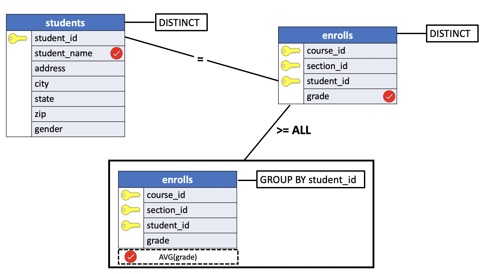
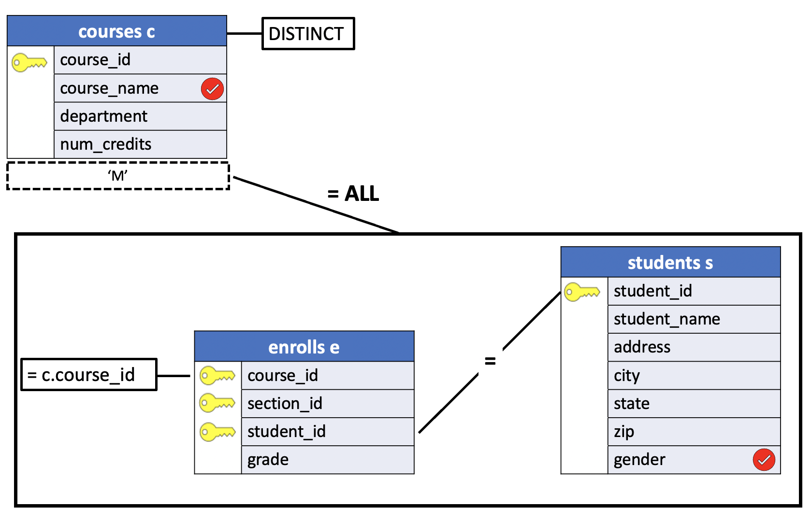

# Using ALL in a Subquery

In the previous lesson we illustrated how to use  the `ANY` operator to compare a value to a set of values returned by a subquery.

**ALL** works in an analogous fashion. Preceding a subquery with some comparison operator and the word `ALL` means that the `WHERE` or `HAVING` clause containing the subquery **will be true only if the comparison is true for** *all* **values returned by the subquery**.

## Introduction to the PostgreSQL ALL operator

The PostgreSQL **ALL** operator is used to **compare a value to a list of values or result set returned by a subquery**.

The following shows the syntax of the **ALL** operator used with a list or a subquery:

```SQL
operator ALL ( v1, v2, v3)

operator ALL ( subquery)  
```

In this syntax:

- The `ALL` operator must be preceded by an comparison operator such as `=`, `!=`, `>`,`>=`, `<`, `<=` and followed by a list or subquery.
- The list or subquery must be surrounded by the parentheses.

Assuming that the subquery returns one or more rows, the following illustrates the meaning of the SQL **ALL** operator:

1. `column_name > ALL (subquery)` the expression evaluates to true if a value is greater than the biggest value returned by the subquery.
2. `column_name >= ALL (subquery)` the expression evaluates to true if a value is greater than or equal to the biggest value returned by the subquery.
3. `column_name < ALL (subquery)` the expression evaluates to true if a value is less than the smallest value returned by the subquery.
4. `column_name <= ALL (subquery)` the expression evaluates to true if a value is less than or equal to the smallest value returned by the subquery.
5. `column_name = ALL (subquery)` the expression evaluates to true if a value is equal to any value returned by the subquery.
6. `column_name != ALL (subquery)` the expression evaluates to true if a value is not equal to any value returned by the subquery.

When you use the **ALL** operator to compare a value to a list, PostgreSQL expands the initial condition to all elements of the list and uses the `AND` operator to combine them as shown below:

```SQL
SELECT *
  FROM table_name
 WHERE c > ALL (
        v1,
        v2,
        v3
    );

--  transform the ALL operator

SELECT *
  FROM table_name
 WHERE c > v1 AND
       c > v2 AND
       c > v3;
```

If the subquery returns no rows, then the following condition evaluates to true:

```SQL
operator ALL (subquery)
```
Which means that the query that uses the above condition in the WHERE clause will return all rows in case the subquery return no rows.

```SQL
SELECT *
  FROM table_name
 WHERE col operator ALL(subquery);
```

## SQL ALL examples

We will use the `students` and  `enrolls` tables in the `uniy` sample database for the demonstration.

**students**

```console
uniy=# \d students
                    Table "public.students"
    Column    |     Type      | Collation | Nullable | Default
--------------+---------------+-----------+----------+---------
 student_id   | smallint      |           | not null |
 student_name | character(18) |           |          |
 address      | character(20) |           |          |
 city         | character(10) |           |          |
 state        | character(2)  |           |          |
 zip          | character(5)  |           |          |
 gender       | character(1)  |           |          |
Indexes:
    "students_pkey" PRIMARY KEY, btree (student_id)
Referenced by:
    TABLE "enrolls" CONSTRAINT "enrolls_fkey_student" FOREIGN KEY (student_id) REFERENCES students(student_id) ON DELETE CASCADE
```

**enrolls**

```console
uniy=# \d enrolls
                 Table "public.enrolls"
   Column   |   Type   | Collation | Nullable | Default
------------+----------+-----------+----------+---------
 course_id  | smallint |           | not null |
 section_id | smallint |           | not null |
 student_id | smallint |           | not null |
 grade      | smallint |           |          |
Indexes:
    "enrolls_pkey" PRIMARY KEY, btree (course_id, section_id, student_id)
Foreign-key constraints:
    "enrolls_fkey_course" FOREIGN KEY (course_id) REFERENCES courses(course_id) ON DELETE CASCADE
    "enrolls_fkey_section" FOREIGN KEY (course_id, section_id) REFERENCES sections(course_id, section_id) ON DELETE CASCADE
    "enrolls_fkey_student" FOREIGN KEY (student_id) REFERENCES students(student_id) ON DELETE CASCADE
```

## SQL ALL with the >= operator

The following query finds rows whose values in the `column_name` are **greater than or equal to the biggest values returned by the subquery**:

```SQL
SELECT *
  FROM table_name
 WHERE column_name >= ALL (subquery);
```

**Problem**: list the names of all students who received a grade in some course that equaled or exceeded the highest all-around average grade.

```SQL
SELECT DISTINCT student_name, grade  
  FROM students
 INNER JOIN enrolls USING(student_id)
 WHERE grade >= ALL
       (SELECT AVG(grade)
          FROM enrolls
         GROUP BY student_id);
```

**Query Diagram**



The result of this query would be the names and grades of students meeting the specified requirement: The names of all students who received a grade in some course that equaled or exceeded the highest all-around average grade, (`4.0`). Because a single student might have received a qualifying grade in more than one class, `DISTINCT` is used to cause that student's name to appear only once in the query's result.

**Results**

|student_name    | grade|
|:---------------:|:------:|
|John Anderson      |     4|
|Joe Adams          |     4|
|Janet Thomas       |     4|


**Problem**: Which courses have only male students?

```SQL
SELECT DISTINCT course_name
  FROM courses c
 WHERE 'M' = ALL
       (SELECT s.gender
          FROM enrolls e
         INNER JOIN students s USING(student_id)
         WHERE e.course_id = c.course_id);
```

**Query Diagram**



**Results**

|course_name|
|:--------------------:|
|Art History|
|English Composition|

## ALL vs. NOT IN

The `!= ANY` is equivalent to `NOT IN` operator.

When used to test for not equality, using `ALL` is exactly equivalent to using `NOT IN`. Therefore, the query:


```SQL
SELECT DISTINCT student_name, grade  
  FROM students
 INNER JOIN enrolls USING(student_id)
 WHERE grade != ALL
       (SELECT grade
          FROM enrolls
         WHERE grade >= 2);
```

is equivalent to:

```SQL
SELECT DISTINCT student_name, grade  
  FROM students
 INNER JOIN enrolls USING(student_id)
 WHERE grade NOT IN
       (SELECT grade
          FROM enrolls
         WHERE grade >= 2);
```


**Results**

|student_name    | grade|
|:-----------------:|:------:|
|Carol Dean         |     0|
|Bob Dawson         |     1|
